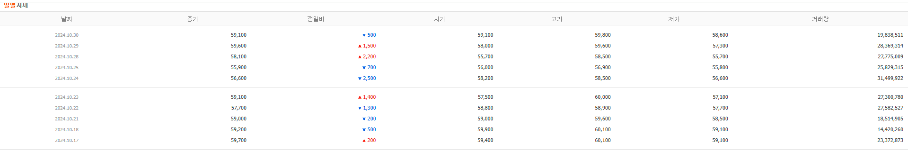
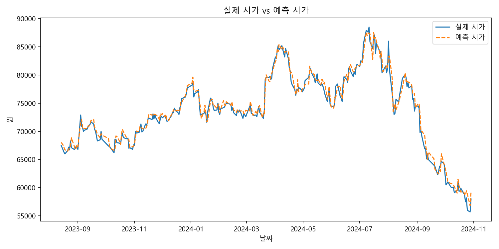
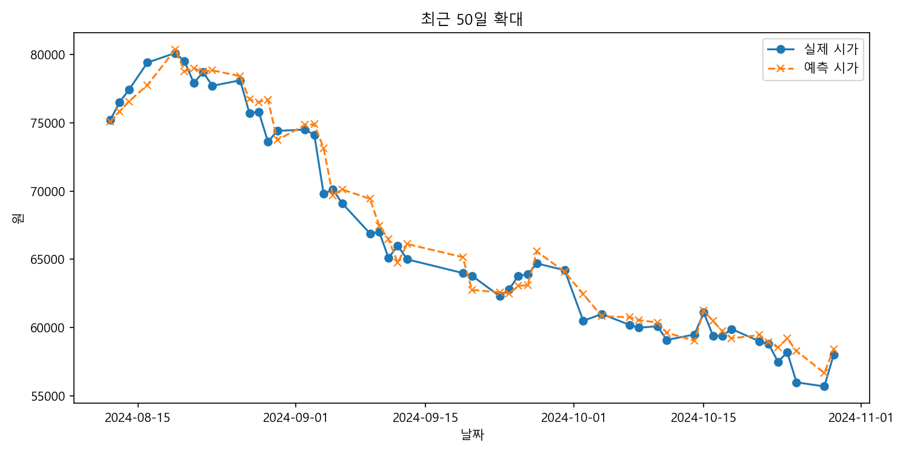

# Stock Analysis And Prediction
웹 스크래핑과 LSTM을 활용한 주가 예측&분석 프로젝트

---

## 🔍 목차

<details>
<summary>목차 보기 (클릭)</summary>

1. [프로젝트 개요](#-프로젝트-개요)  
2. [기술 스택](#-기술-스택)   
3. [데이터 수집](#-데이터-수집)  
4. [데이터 전처리](#-데이터-전처리)  
5. [모델링](#-모델링)  
6. [결과 및 평가](#-결과-및-평가)  
7. [향후 계획](#-향후-계획)  

</details>

---

## 📋 프로젝트 개요

**목표)**  
- 과거 주가 데이터를 활용해 다음 날 시가를 예측하고, 이를 통해 의사결정에 도움을 주는 모델 개발

**역할)**  
- 웹 스크래핑: 네이버 금융에서 일별 주가 데이터 자동 수집  
- 데이터 전처리: 결측치 처리와 스케일링, 시퀀스 생성 파이프라인 설계  
- 모델 개발: LSTM 네트워크 구현 및 하이퍼파라미터 튜닝  
- 결과 시각화: 학습·검증 손실과 예측 결과를 자동으로 플롯하고 저장

**성과)**  
- MAPE(평균 절대 백분율 오차) 1% 미만 달성  
- 전체 예측 그래프와 최근 N일 확대 그래프 자동 저장 기능 구현  

---

## 🛠 기술 스택

- **언어**: Python 3.8+  
- **웹 스크래핑**: urllib (*Request*, *urlopen*), BeautifulSoup  
- **데이터 전처리**: pandas, numpy, scikit-learn (*StandardScaler*)  
- **모델링**: TensorFlow/Keras (*Sequential*, *LSTM*, *Dense*, *Adam*)  
- **모델 평가**: scikit-learn (*mean_squared_error*, *r2_score*, *mean_absolute_percentage_error*)  
- **시각화**: Matplotlib 

---

## 📊 데이터 수집

- **소스**: [네이버 금융 일별 시세 – 삼성전자(005930)](https://finance.naver.com/item/sise_day.naver?code=005930)
- **형태**:
     

---

## 🧹 데이터 전처리

1. **문자열 정제**  
   - `volatility`에서 `%` 제거 후 숫자만 추출  
     ```
     df['volatility'] = df['volatility'].str.extract(r'([\d\.]+)').astype(float)
     ```
   - 나머지 피처(`close`, `open`, `high`, `low`, `volume`)를 `float(실수)` 형태로 변환  
     ```
     df[['close','open','high','low','volume']] = df[['close','open','high','low','volume']].astype(float)
     ```

2. **날짜 처리 & 정렬**  
   - `date`를 `datetime(날짜)` 타입으로 변환  
     ```
     df['date'] = pd.to_datetime(df['date'], format='%Y.%m.%d')
     ```
   - 오름차순 정렬 및 인덱스 재설정  
     ```
     df.sort_values('date', inplace=True)
     df.reset_index(drop=True, inplace=True)
     ```

3. **스케일링**  
   - `StandardScaler`로 정규화
     ```
     scaler = StandardScaler()
     X_scaled = scaler.fit_transform(df[features].values)
     ```
4. **데이터 분할**
   - 전체 데이터의 70%를 학습용 데이터로, 30%를 테스트용 데이터로 분할
   ```python
   n_train  = int(len(df) * 0.7)
   train_df = df.iloc[:n_train]
   test_df  = df.iloc[n_train:]

5. **시퀀스 생성**  
   - 7 거래일 단위(`seq_len = 7`)로 다음 날 예측(`pred_steps = 1`):
     ```
     X, y = preprocessor.create_sequences(X_scaled, seq_len = 7, pred_steps = 1)
     ```
     
**전처리 후 데이터셋의 모습 (첫 5행)**

| date       |   close   | volatility |    open   |    high   |     low    |     volume    |
|------------|-----------|------------|-----------|-----------|------------|---------------|
| 2020-10-07 |  59900.0  |    900.0   |  58700.0  |  59900.0  |  58500.0   | 14861838.0    |
| 2020-10-08 |  59700.0  |    200.0   |  60500.0  |  60700.0  |  59500.0   | 24589924.0    |
| 2020-10-12 |  60400.0  |    700.0   |  60000.0  |  60400.0  |  59900.0   | 16145837.0    |
| 2020-10-13 |  60900.0  |    500.0   |  61000.0  |  61400.0  |  60400.0   | 19247631.0    |
| 2020-10-14 |  60900.0  |      0.0   |  61000.0  |  61100.0  |  60500.0   | 16086716.0    |

---

## 🧠 모델링

- **하이퍼파라미터**  
  | 파라미터      | 값    |
  |---------------|------|
  | seq_len       | 7    |
  | batch_size    | 32   |
  | epochs        | 30   |
  | learning_rate | 0.01 |

- **학습 코드**  
  ```python
  model = LSTMModel(seq_len = 7, n_features = X.shape[2], lr = 0.01)
  history = model.train(trainX, trainY, epochs = 30, batch_size = 32)

---

## 📈 결과 및 평가

- **평가지표**

  | 지표  | 값            |
  |------|--------------|
  | MSE  | 860050.46   |
  | R²   | 0.98         |
  | MAPE | 0.94%        |

  - **MSE (Mean Squared Error - 평균 제곱 오차)**  
    예측값과 실제값 차이를 제곱해 평균한 지표  
    전체적인 예측 오차의 크기를 나타냄  

  - **R² (결정계수)**  
    모델이 실제 시가 변동성을 얼마나 잘 설명하는지를 보여주는 지표   
    일반적으로 R² ≥ 0.6을 유의미하다고 판단하며, R² = 0.98은 모델이 전체 변동성의 98%를 설명해 내는 설명력을 가졌다는 것을 의미  

  - **MAPE (Mean Absolute Percentage Error - 평균 절대 백분율 오차)**  
    예측 오차를 실제 시가 대비 백분율로 환산해 평균한 지표   
    0.94%의 MAPE는 모델 예측값이 실제 시가에서 평균적으로 약 0.94% 차이난다는 것을 의미   

- **학습/검증 손실 그래프**  
  
    - **초기의 급격한 하락**  
      1 ~ 2번째 epoch 사이에 학습 손실(loss)과 검증 손실(val_loss)이 0.2 → 0.03 수준으로 빠르게 감소해, 모델이 초기에 효과적으로 학습했음을 보여줌

    - **빠른 수렴**  
      3 ~ 10번째 epoch 구간에서 손실이 0.01 이하로 안정화  
      10 epoch 이후에는 추가 학습에도 큰 개선이 없으며, 학습/검증 손실이 거의 겹쳐지며 평행하게 유지 → 과적합 징후가 나타나지 않음

    - **미세한 변동**  
      중후반(15 ~ 30번째 epoch)에서 손실이 0.005 ~ 0.01 사이를 오가며 소폭 등락  
      검증 손실이 학습 손실보다 약간 낮은 구간도 있어, 학습률과 배치 크기가 비교적 적절하게 설정되었음을 시사

- **전체 예측 그래프 (23.08.16 ~ 24.10.30)**  
  
   - **전반적인 추세 일치**  
    전체 테스트 기간 동안 파란 실선(실제 시가)과 주황 점선(예측 시가)이 거의 겹치는 경향을 보여, 모델이 장기 트렌드를 잘 포착했음을 보여줌 

  - **잔차(Residual) 수준**  
    평균 잔차 규모는 RMSE ≈ 927원  
    y축(약 55000 ~ 90000원) 범위 대비 오차 폭이 매우 작다는 것을 알 수 있음

  - **일시적 편차 및 반응 지연 (개선 필요)**  
    변곡점과 급격한 등락 구간에서 예측 곡선이 실제 곡선에서 소폭 이탈  
    특히 변동성이 큰 시점에는 모델 반응이 다소 지연되는 경향이 관찰됨

- **최근 거래일 예측 그래프 (24.09.11 ~ 24.10.30)**  
  
  - **단기적인 추세 일치**  
    파란 실선(실제 시가)과 주황 점선(예측 시가)이 대체로 겹쳐져,  
    모델이 단기 30거래일 구간의 **하락·반등·급등락** 패턴을 잘 따라갔음을 보여줍니다.

  - **초기 구간(9/8~9/15)**  
    9/8~9/10: 하락세 직후 예측이 약간 **과대(오렌지봉 높음)** 했으나,  
    9/11~9/15: 반등 시점과 폭을 비교적 정확히 포착

  - **중후반 변동 구간(9/20~10/1)**  
    9/24 급등 시점: 예측이 실제보다 **약간 더 크게** 상승 폭을 잡아 냄  
    이후 하락 구간에선 실제 낙폭보다 **소폭 과소 예측** 경향

  - **중앙 평탄 구간(10/1~10/10)**  
    거래 빈도가 낮은 완만한 하락/횡보 구간에서 예측과 실제가 거의 일치  
    **MAPE ~0.7%** 수준의 안정적 성능 확인 가능

  - **스파이크 관찰(10/15)**  
    10/15 한 번의 급등 시점에 예측이 **제대로 봉우리를 포착**해 뛰어난 반응 속도 시사

  - **후기 하락장(10/20~10/29)**  
    10/20 이후 지속 하락 구간에서 예측이 **약간 보수적으로** 작게 예측했으나,  
    최저점(10/25~10/27)에서 반등 시점까지 적절히 따라붙음

  - **결론**  
    **대부분의 거래일**에서 실제와 예측이 **±500원 이내**로 근접  
    단기 패턴(반등·급등·급락)을 고르게 잡아내 예측 반응성이 우수  

- **다음 날(24.10.31) 시가 분석**  
  | 날짜       | 예측 시가     | 실제 시가     | 절대 오차   | 백분율 오차 |
  |-----------|--------------|--------------|------------|-----------|
  | 2024-10-31 | 59,212.94원 | 58,500.00원 | 712.94원  | 1.22%     |

   -  1. **절대 오차(712.94원)**  
      6만 원대 시가 기준으로 약 **713원** 차이가 났습니다.  
      이는 전체 거래일 평균 RMSE(≈927원)보다 **작은 편**으로, 하루치 예측치로서 매우 양호한 수준입니다.

   - 2. **백분율 오차(1.22%)**  
     일반적으로 **1~2%** 이내 오차는 “단기 주가 예측에서 우수”로 간주됩니다.  
     본 모델의 **1.22%** 오차는 “단기(1거래일) 예측에서 안정적인 정확도”를 보여 줍니다.

  - 3. **실제 대응력**  
    급락·급등 등 극단적 변동이 없었던 평범한 거래일임을 감안할 때,  
    모멘텀(추세)과 리버전(반등) 모두 적절히 반영해 예측했다는 점이 인상적입니다.
 
---

## 🚀 향후 계획

- **실시간 대시보드 개발**  
  - Streamlit 기반 웹앱으로 예측 결과·손실 곡선을 실시간 모니터링  
  - 주요 지표 알림(이상치, 급변 구간) 기능 추가

- **LLM 연계 자동 보고서 생성**  
  - 예측 결과와 지표를 ChatGPT 등 대형 언어 모델과 연결해  
  - 자연어 요약·인사이트 리포트를 실시간으로 자동 작성
  
